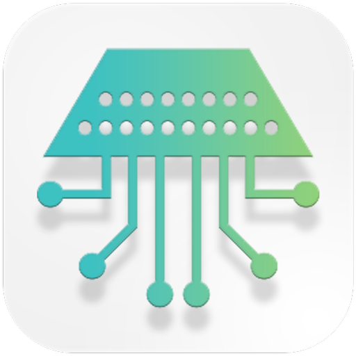
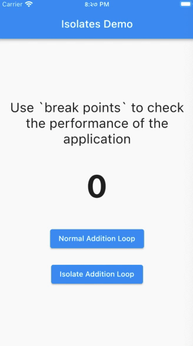
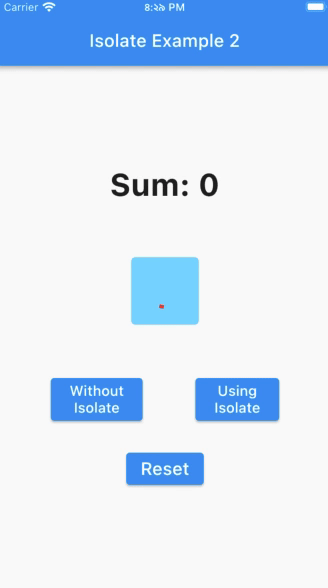
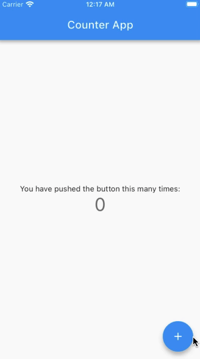

&nbsp;&nbsp;
&nbsp;&nbsp;
&nbsp;&nbsp;
&nbsp;&nbsp;

# Flutter Multithreading

</img>
This repo is for understanding multithreading implementation in flutter ecosystem. Flutter, in its core, is a single-threaded SDK. But there is an option of multithreading for developers. Useful links are available below: 

1. Concurrency in Dart: https://dart.dev/guides/language/concurrency
2. Details of Isolate-class: https://api.flutter.dev/flutter/dart-isolate/Isolate-class.html

## Screenshots

</img>
&emsp;
</img>
&emsp;
</img>
